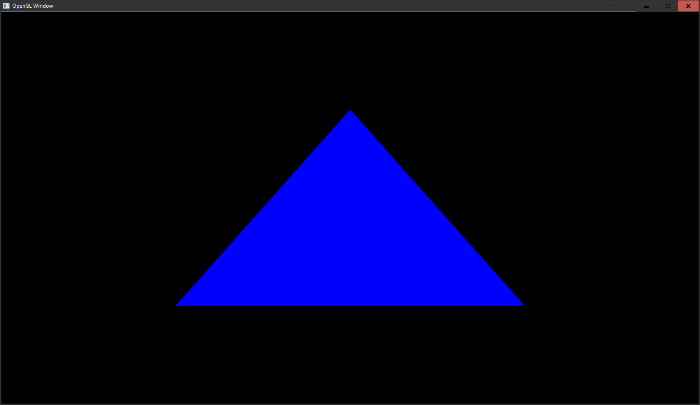

# OpenGL-Basic
Empty OpenGL Project to be used as a base for other projects.
The sublime build script is designed to be run on MinGW G++ which will need to be configured into the PATH of the windows shell.

## How to setup
1. Download and install Cygwin (https://www.cygwin.com/)
   * Remember to add additional libraries for OpenGL.
2. Download GLFW binaries (Project was compiled with version 3.2.1, http://www.glfw.org/download.html)
   * Go into the lib-mingw-w64 or lib-mingw and copy all the contents to the directory called lib/.
   * A readme is provided in the lib directory to indicate this.
   * Go into the include directory and copy all the contents to the directory called include/ under the main project folder.
3. Download GL3W (https://github.com/skaslev/gl3w)
   1. Go into the include directory and copy all the contents to the directory called include/ under the main project folder.
   2. Run gl3w_gen.py using Python 3 (https://www.python.org/). This will generate gl3w.h and gl3w.c.
   3. Copy gl3w.h into the include/GL/ directory (Overwrite pre-existing if any).
   4. Copy gl3w.c into the main directory of the project.
  
## Keybindings
   * **'M'** Used to toggle metrics. Shows FPS each seconds aswell as the longest and shortest render time on the GPU.
   * **'F'** Used to toggle wireframe mode. Fully render primatives or only their outlines.

## Screenshot
This is how the program looks when running if everything is working properly.

